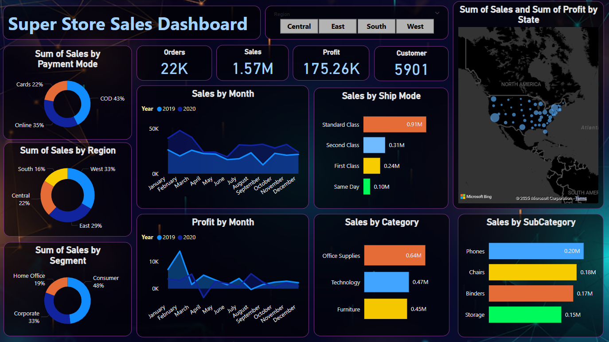

# 🛒 Super Store Sales Dashboard - Power BI

This repository contains an interactive Power BI dashboard for analyzing the sales performance of a fictional Super Store. It provides key insights into orders, sales, profits, and customer behavior across multiple dimensions such as region, category, and shipping mode.

## 📊 Dashboard Highlights

- **Key Performance Indicators (KPIs):**
  - Total Orders: 22K
  - Total Sales: $1.57M
  - Total Profit: $175.26K
  - Total Customers: 5,901

- **Visualizations Include:**
  - Sales and Profit by Month (2019 vs 2020)
  - Sales by Region, Segment, Category, and Subcategory
  - Payment Mode Distribution
  - Shipping Mode Breakdown
  - Interactive US Map: Sales and Profit by State

- **Filters:**
  - Region-level slicers (Central, East, South, West) for focused analysis

## 🧠 Insights

- **High-Selling Region:** West (33% of total sales)
- **Most Popular Segment:** Consumer (48%)
- **Top Ship Mode:** Standard Class
- **Top Category by Sales:** Office Supplies ($640K)
- **Top Subcategory:** Phones ($200K)

## 📁 Files

- `Super_store_sales_analysis.png`: Screenshot of the Power BI dashboard  
- `Sales Dashboard.pbix`: Power BI file containing the interactive dashboard

## 🚀 Getting Started

To explore or edit the dashboard:
1. Clone the repository
2. Open `Super_Store_Sales_Dashboard.pbix` in [Power BI Desktop](https://powerbi.microsoft.com/desktop/)
3. Customize, explore, or publish to Power BI Service

## 📌 Requirements

- Power BI Desktop (Latest version recommended)
- Dataset: Superstore Sales (CSV or Excel format)

## 🛠️ Tools Used

- Power BI Desktop
- DAX for calculated fields
- Custom visuals and slicers
- Microsoft Bing Maps integration

## 🙋‍♂️ Author

**[Aastha Rajput]**  
[🔗 LinkedIn](www.linkedin.com/in/aastha-rajput2004)    

---

⭐ If you like this project, please consider giving it a star!
